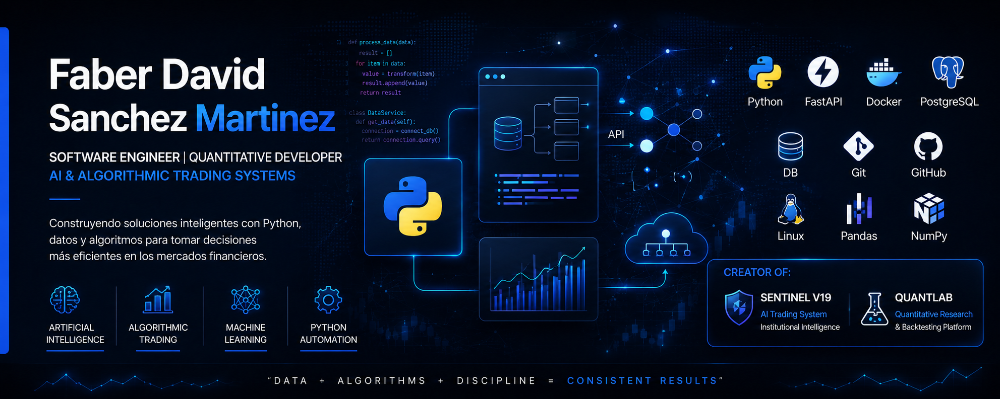

  

<h1 align="center">
Hi 👋 I'm Faber David Sanchez Martinez
</h1>

<h3 align="center">
Python Software Engineer | Algorithmic Trading Developer | Backend Developer
</h3>

Building intelligent software, quantitative trading systems and scalable backend applications.

---

# 🚀 About Me

I'm a Systems Engineering student and Python developer passionate about creating intelligent software capable of solving real-world problems.

My primary focus is on:

- 🤖 Artificial Intelligence
- 📈 Algorithmic Trading
- ⚡ High Performance Python
- 🌐 Backend Development
- 🔬 Data Analysis
- 🧠 Quantitative Research
- ☁ Cloud Architecture
- 🐳 DevOps

---

# 💻 Tech Stack

### Languages

---

### Backend

---

### Databases

---

### DevOps

---

### Data Science

---

### Tools

---

# 🔥 Featured Projects

## 🛡 Sentinel

Advanced AI-powered algorithmic trading platform.

Features:

- Artificial Intelligence
- Institutional Market Analysis
- Multi-Agent Architecture
- Risk Management
- Explainable AI
- Real-Time Decision Engine

---

## 📊 QuantLab

Professional quantitative research environment.

Features:

- Strategy Development
- Backtesting
- Indicators
- Performance Analytics
- Statistical Validation

---

# 📈 Current Learning

- Advanced Python
- Software Architecture
- FastAPI
- Docker
- PostgreSQL
- Machine Learning
- Deep Learning
- Quantitative Finance

---

# 🎯 Goals

✔ Build world-class software

✔ Contribute to Open Source

✔ Create professional algorithmic trading systems

✔ Master Artificial Intelligence

✔ Develop scalable backend applications

---

# 📫 Contact

- GitHub: https://github.com/Fabersanchez

---

⭐ Thanks for visiting my profile!

